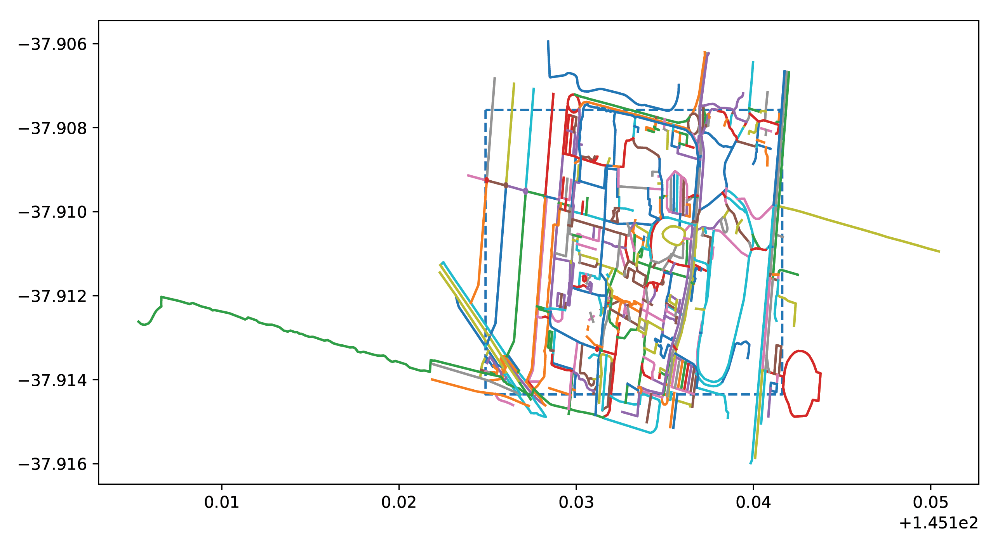
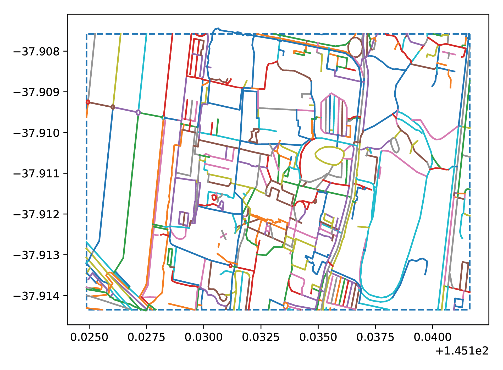
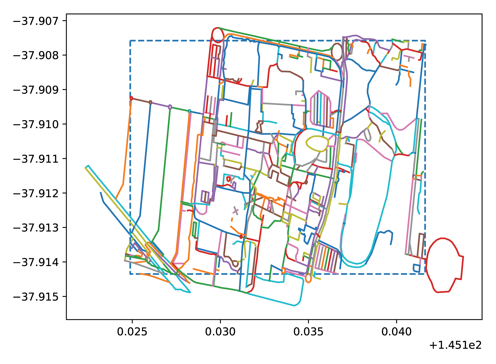

# Road Surface Area Estimation
Produced for Monash University during FIT3036 (Computer Science Project) Semester 1, 2018.

Produced by: _Michael Franklin_  
Supervised by: _Dr. Rasika Amarasiri_

With the ever-increasing size of cities and their infrastructure, this project develops a tool that sources data from OpenStreetMaps in order to estimate the surface area of roads within a given bounding rectangle.

## Quick Start Guide
Run the project by executing the following command in the project's directory:
`npm start -s`

### Prerequisites
1. Ensure [NodeJS](https://nodejs.org/en/) and NPM is installed.
2. Open up Terminal / Command Prompt and change into the project's directory
3. Install all of the NPM packages by: `npm install` (listed below)

### Potential Fixes:
Ensure you have installed all NPM packages (by `npm install`)

## Introduction

This introduction and subsequent information is taken from the submitted report: [Final Report](resources/report.pdf)

### Calculation

The major component of this project is the ability to estimate the road surface area within some confined coordinate bounds, this first requires acquiring the data from a web-mapping provider and then processing the result. We query this data from a mirror of OpenStreetMap called Overpass. Overpass allows us to use a query to gain a narrow set of information, saving bandwidth and reducing the processing required by our server.

Overpass returns additional information outside the bounding box to give us enough context to correctly draw the map, so we introduce 3 calculation modes to allow the user to decide how to handle this:
- Include: Include all information returned by Overpass in the calculation, do not perform any filtering.
- Intersect: Intersect the road at the bounds by calcluating an intemediary point at the border and disregarding all other points outside.
- Truncate: Truncate the road to the nearest intersection.

The results of these calcluations can be found in the images below (of Monash University):

|Include|Intersect|Truncate|
|-|-|-|
||||

## Notes:
This project used [Cory House](https://www.pluralsight.com/authors/cory-house)'s [React template](https://github.com/coryhouse/pluralsight-redux-starter), offered by [PluralSight](https://www.pluralsight.com/courses/react-redux-react-router-es6) as as a base patterning for a React application. This template assists in the support for babel and babel-polyfill for writing ES5 / ES6 that is compiled into a single page application. 

Some of the dependencies are derived from the base template, and other (such as react-router-redux) have been ommitted from the list has they're dependencies of React.

### Dependencies
| **Dependency** | **Use** |
|----------|-------|
|axios| Used to make network requests |
|babel-polyfill| Compiles any higher-level JS to browser understandable code |
|material-ui| React UI component library |
|material-ui-icons| Apart of material-ui |
|leaflet| Map Container view |
|react-number-format| Appropriately displays large numbers |
|react-places-autocomplete| Search places by address |
|redux| State management in React |
|xml2js| Parse XML response from OpenStreetMap |

### Development Dependencies
| **Dependency** | **Use** |
|----------|-------|
|babel-cli|Babel Command line interface |
|babel-core|Babel Core for transpiling the new JavaScript to old |
|babel-loader|Adds Babel support to Webpack |
|babel-plugin-react-display-name| Add displayName to React.createClass calls |
|babel-preset-es2015|Babel preset for ES2015|
|babel-preset-react| Add JSX support to Babel |
|babel-preset-react-hmre|Hot reloading preset for Babel|
|babel-register|Register Babel to transpile our Mocha tests|
|cheerio|Supports querying DOM with jQuery like syntax - Useful in testing and build process for HTML manipulation|
|compression|Add gzip support to Express|
|cross-env|Cross platform support for environment variables|
|css-loader|Add CSS support to Webpack|
|enzyme|Simplified JavaScript Testing utilities for React|
|eslint|Lints JavaScript |
|eslint-plugin-import|Advanced linting of ES6 imports|
|eslint-plugin-react|Adds additional React-related rules to ESLint|
|eslint-watch|Add watch functionality to ESLint |
|eventsource-polyfill|Polyfill to support hot reloading in IE|
|expect|Assertion library for use with Mocha|
|express|Serves development and production builds|
|extract-text-webpack-plugin| Extracts CSS into separate file for production build | 
|file-loader| Adds file loading support to Webpack |
|jsdom|In-memory DOM for testing|
|mocha| JavaScript testing library |
|npm-run-all| Display results of multiple commands on single command line |
|open|Open app in default browser|
|react-addons-test-utils| Adds React TestUtils |
|redux-immutable-state-invariant|Warn when Redux state is mutated|
|redux-mock-store|Mock Redux store for testing|
|remote-redux-devtools| Debugging state with Redux |
|rimraf|Delete files |
|style-loader| Add Style support to Webpack |
|url-loader| Add url loading support to Webpack |
|webpack| Bundler with plugin system and integrated development server |
|webpack-dev-middleware| Adds middleware support to webpack |
|webpack-hot-middleware| Adds hot reloading to webpack |
